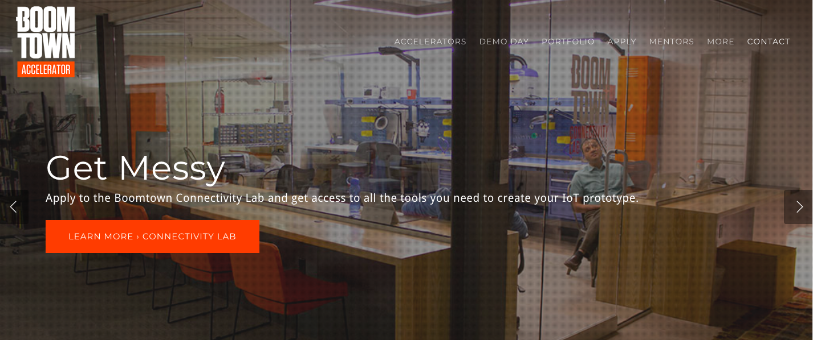
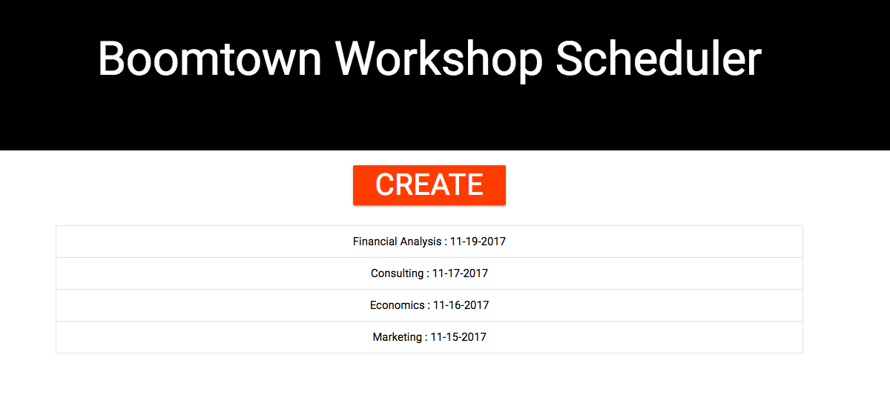
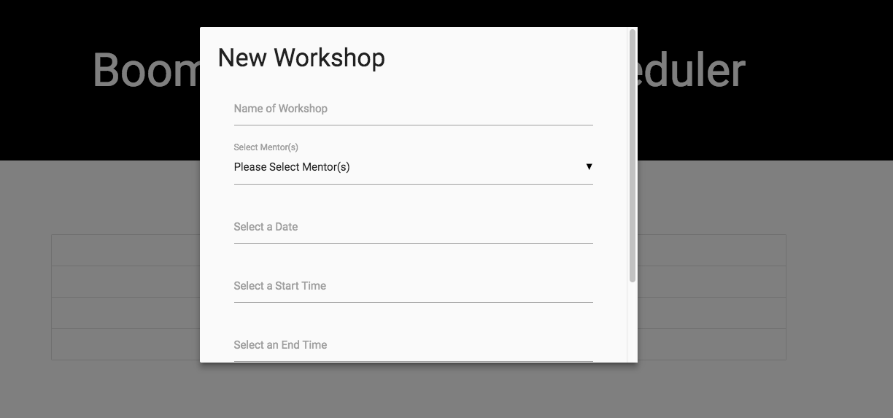
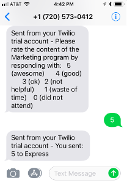
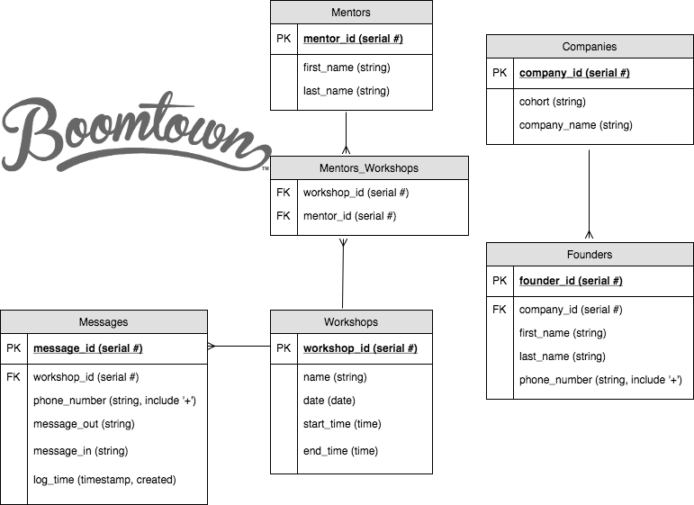

# BoomTown Admin Workshop Scheduler

### This administrative application is primarily designed for the scheduling and feedback management of Boomtown Workshops.  Classes are listed on the launch page with options for creating, editing and deleting classes.  Upon the completion of a class, a push notification is sent to the founders so that feedback may be retrieved to determine the class effectiveness from the student’s perspective.  An appended page shows the data analytics of provided course feedback that will be taken in consideration for future modifications of that course.  

Motivation
The motivation behind this project came from a current concern facing the founders and staff of the Boomtown (entrepreneurial start-up accelerator) regrading the feedback needed to determine the effectiveness of their courses provided.  To ensure that they are providing the best and most effective techniques and course criteria for their founders, receiving back and interpreting feedback is crucial.  This prompted the creation of the BoomTown Admin Workshop Scheduler and Messenger.

### Getting Started

Access the app from the website:
https://boomtown-rocks.herokuapp.com/

Click the 'create button' to access a modal to add an event.  Click any of the events listed to access a modal to edit or delete that event.  Clicking 'submit', 'create', or 'edit' at the bottom of modal automatically updates the events list to reflect any changes made.

The feedback section of the app sends the event attendee a phone message from Twilio.  The attendee sends a numerical rating of the event from 1 to 5, which automatically gets stored in a database.

### Source Files

Fork and Clone app from Github (master branch):
https://github.com/llamacoder/q2-boomtown

Prerequisites: NodeJS

Navigate to the folder where you would want to fork and clone the app.  Fork and clone the app, then run the following commands on the terminal:

> npm install
> dropdb bws_dev
> createdb bws_dev
> knex migrate:latest
> knex seed:run

To open the html page, type the following on the terminal:

> npm start

Then open a browser to localhost/8000

To open the source files in atom, type the following on the terminal:

> atom .

The database structure contains 6 tables, arranged in the following entity-relationship-diagram:

To access the database, run the following commands
> npm install
> dropdb bws_dev
> createdb bws_dev
> knex migrate:latest
> psql bws_dev

Navigating and editing the database on command line requires PSQL commands.  Navigating and editing the database in the app.js requires knex commands.

### Testing

To test the app, run the following command on the terminal:
> npm test

The tests cover seed migrations, Web Interface server routes, and Twilio API server routes.  If the tests don't automatically stop, then type the following keys simultaneously:
> ctrl + c

### Contributions

Super Contributors
* Boomtown
* Jodie Rigali (Product Manager)
* Teddi Maull
* Sean Helvey
* Ross Tienken
* Patrick Glynn

App Authors
* Tracey Dolsen: Team Lead, Server Side, Master of All Trades
* Olivia Burgener: Web Design,  Modal Programming
* Neal Balaoing: Web Design, Web Routes Tests
* Scott Rushford: Seeding Tests, Data Visualization

Built With
* Twilio - Mobile Messaging
* Node-schedule
* ChartJS
* Trello - Planning Purposes
* Knex
* Express
* Axios
* Materialize
* jQuery
* HTML
* CSS
* JS
* Path
* Chai
* Dotenv
* Chai-As-Promised
* Body-Parser
* Morgan
* Cors
* PostgreSQL
* NPM
* Mocha

### Versioning
We use SemVer for versioning. For the versions available, see the tags on this repository.

### License
This project is licensed under the MIT License
